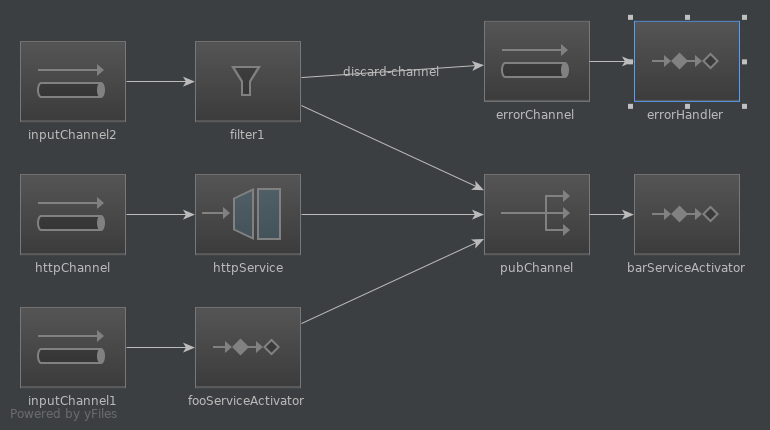

# spring-integration-sample-app



## Use case

The diagram presents 3 channels:
- inputChannel1
- inputChannel2
- httpChannel

Each one have his respective endpoint
- /channel/1
- /channel/2
- /channel/http

## System requirements
- docker
- docker-compose

## How to work

```
docker-compose up
```

## Example

```
curl http://localhost:8080/channel/1/hello
{"id":0,"msg":"hello"}
curl http://localhost:8080/channel/2/hello
{"id":0,"msg":"hello"}
curl http://localhost:8080/channel/2/fail
Failed to put message [fail] on channel [inputChannel2]
```
